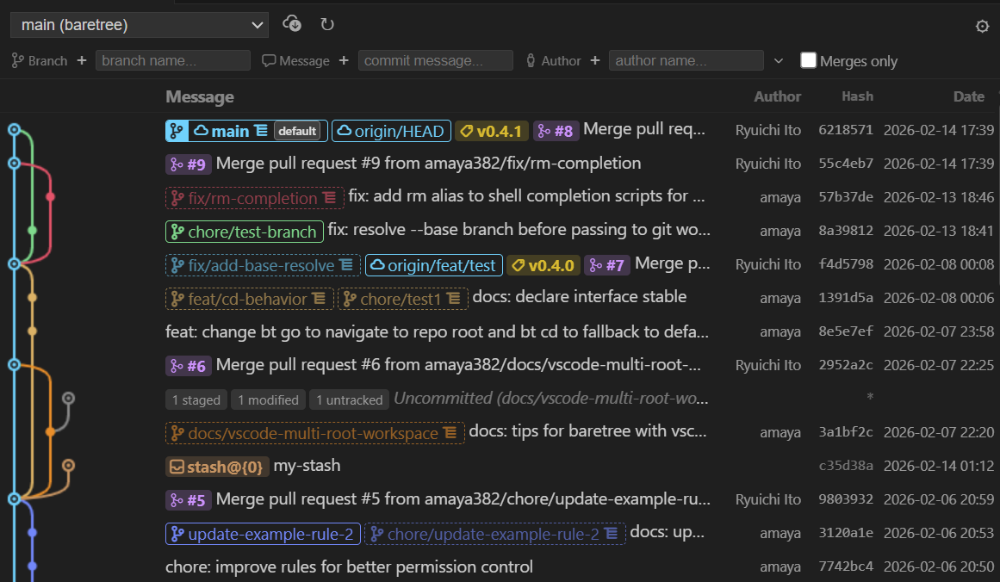
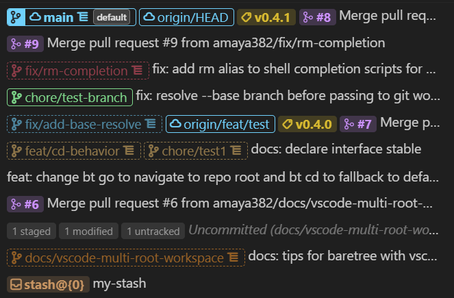
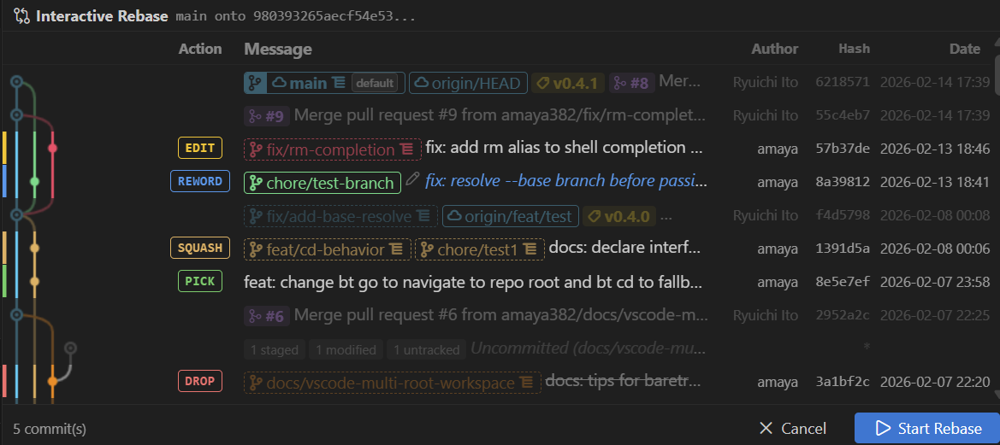
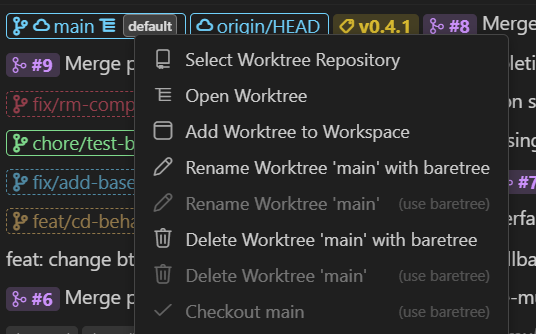

<h1 align="center"> Git Treegazer</h1>

  
  

  <strong>Observe your Git repository from the treetop.</strong> 
  A VSCode extension for visualizing git log graphs and performing git operations with a compact, information-dense UI — with first-class worktree support.

## Features

### Git Log Graph

- Visual branch/merge graph with color-coded lanes, commit details, and resizable columns
- Click to view diffs, Ctrl+click to compare any two commits
- Uncommitted changes, stashes, and GitHub PR badges displayed inline
- Filtering by branch, message, author, and merge commits

### Ref Badges

- Branches, tags, GitHub PRs (open/draft/closed/merged), and worktree indicators as colored badges
- Ahead/behind indicators (↑/↓) and configurable prefix abbreviation (e.g., `feature/auth` → `f/auth`)

### Interactive Rebase

- Full interactive rebase UI with pick, reword, edit, squash, fixup, drop
- Drag-and-drop reordering with color-coded action indicators
- Rebase state tracking across all worktrees with conflict detection

### Worktree Management

- View, create, and remove worktrees in a dedicated tree view
- Open worktree in a new window or add to current workspace
- **[baretree](https://github.com/amaya382/baretree) integration**:
  - Create worktrees via baretree with default worktree badges
  - baretree-recommended actions surfaced in context menus
  - Post-create actions (symlink, copy, command) and sync-to-root configuration
  - Worktree lifecycle notifications — prompts to clean up merged worktrees

### Other

- Rich context menus on branches, tags, commits, ref badges, and stash
- Multi-root workspace support with repository switching synced to VSCode's SCM view
- Browse and edit git config entries (local & global), manage remotes (add, rename, remove, set URL)
- Pre-merge/pre-stash conflict detection (`git merge-tree`, Git 2.38+ with fallback)

## Requirements

- VSCode 1.85.0 or later
- Git 2.20+ (Git 2.38+ recommended for conflict detection)

## Extension Settings

| Setting                                     | Default | Description                                                                     |
| ------------------------------------------- | ------- | ------------------------------------------------------------------------------- |
| `gitTreegazer.layout.abbreviateRefPrefixes` | `0`     | Max length for slash-separated prefixes in branch names. `0` = no abbreviation. |
| `gitTreegazer.syncWithScm`                  | `true`  | Synchronize active repository selection with VSCode's built-in SCM view.        |

